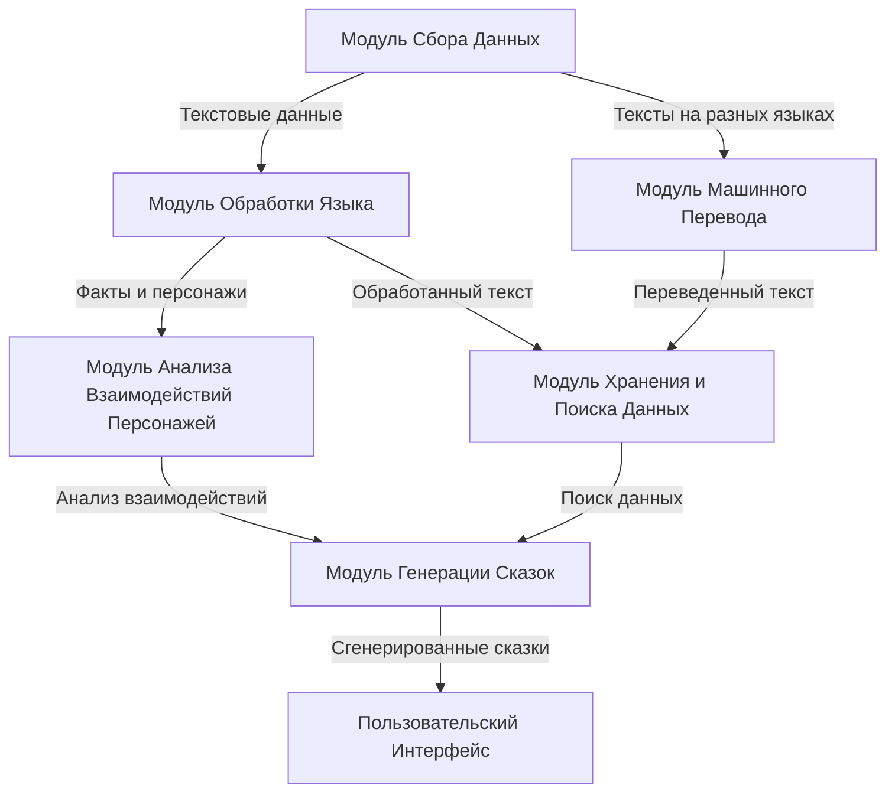

# Обзор Архитектуры Системы

```mermaid
graph TD
    A[Модуль Сбора Данных] -->|Текстовые данные| B[Модуль Обработки Языка]
    A -->|Тексты на разных языках| E[Модуль Машинного Перевода]
    B -->|Обработанный текст| D[Модуль Хранения и Поиска Данных]
    E -->|Переведенный текст| D
    B -->|Факты и персонажи| C[Модуль Анализа Взаимодействий Персонажей]
    C -->|Анализ взаимодействий| F[Модуль Генерации Сказок]
    D -->|Поиск данных| F
    F -->|Сгенерированные сказки| G[Пользовательский Интерфейс]
```

